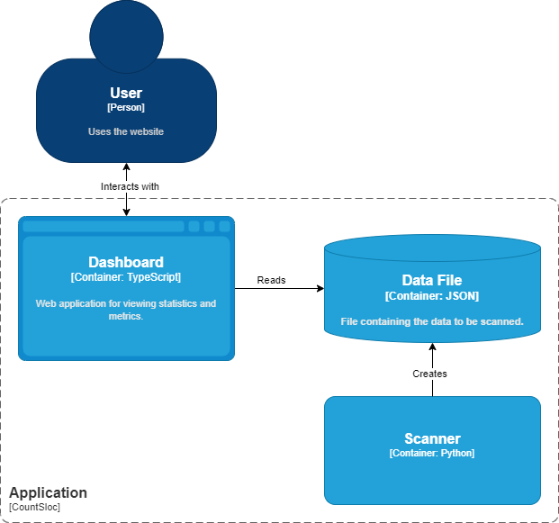

# Sloc Count

Count the number of source lines of code (SLOC) in my projects. As well as a summary of the number of all projects.

## Table of Contents

- [Sloc Count](#sloc-count)
  - [Table of Contents](#table-of-contents)
  - [Architecture](#architecture)
  - [Contributing](#contributing)
  - [License](#license)

## Architecture

## Contributing

We welcome contributions to the project. Please read the [Contributing Guidelines](docs/CONTRIBUTING.md) for more information.

## License

This project is licensed under the MIT License. See the [LICENSE](LICENSE) file for details.
